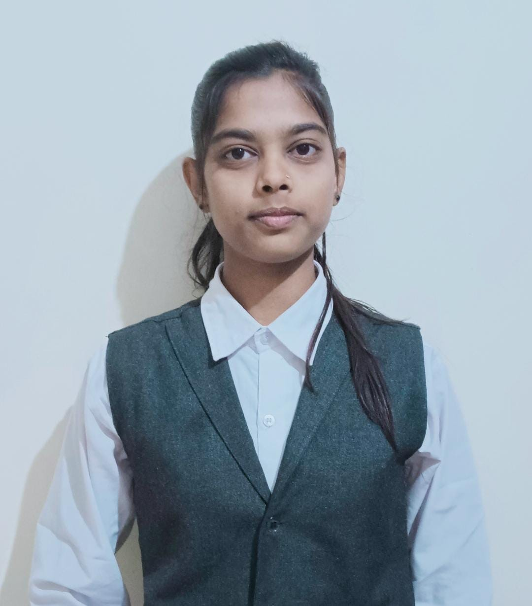

<!DOCTYPE html>
<html lang="en">

<head>
    <meta charset="UTF-8">
    <meta name="viewport" content="width=device-width, initial-scale=1.0">
    <title>Sejal's personal portfolio</title>
    <link rel="poppins" href="https://fonts.google.com/specimen/Poppins?query=po">
    
</head>

<body>
    <header>
        <nav>
            
RITIKA's PORTFOLIO

            

                <ul>
                    <li> <a href="/">HOME</a></li>
                    <li> <a href="/">ABOUT</a></li>
                    <li> <a href="/">SERVICES</a></li>
                    <li> <a href="/">PROJECTS</a></li>
                    <li> <a href="/">CONTACT ME</a></li>
                </ul>
            

        </nav>
    </header>
    <main>
        <section class="firstsection">
            
Hi my name is  Ritika Chourasiya
                
and I'm a passionate 

                <!-- 
Web Developer
 -->
                
                

                    <button class="btn">Download Resume</button>
                    <button class="btn">Visit Github</button>
                

            

            

                
                <!-- 

                    HTML Developer (2010-2012)
                
 -->
                <!-- 

                    Lorem ipsum dolor sit, amet consectetur adipisicing elit. Voluptate repudiandae nostrum, eligendi
                    blanditiis, inventore consequuntur pariatur praesentium est, dicta iure culpa cum nobis!
                
 -->
            <!-- 

            

                Node.js Developer (2012-2014)
            
 -->
        </section>
        

        <section class="secondsection">
            What i have done so far
            <h1>Education</h1>
             
            <ol>
                <li>12th pass from MP board</li>
                <li>Currently in 7th semester </li>
                <li>Branch-Computer Science</li>
                <li>College-Bansal institute of research and technology</li>
            </ol>
             
            <h1>Skills</h1>
             
            <ol>
                <li>Html,Css,Js</li>
                <li>SQL,MS word, Power Point</li>
                <li>C,C++</li>
                <li>Cyber Security</li>
                <li>Project Management</li>
            </ol>
             
            <h1>Contact Me</h1>
             
            <ul>
                <li>+91 8770265494</li>
            </ul>
             
            <h1>Address</h1>
             
            <ul>
                <li>B-19 sarvjan colony lalita nagar kolar road Bhopal(MP)</li>
            </ul>

            <!-- 

                

                     -->
                <!-- 

                

                

                

            
 -->

        </section>
    </main>
    

    
</body>

</html>
